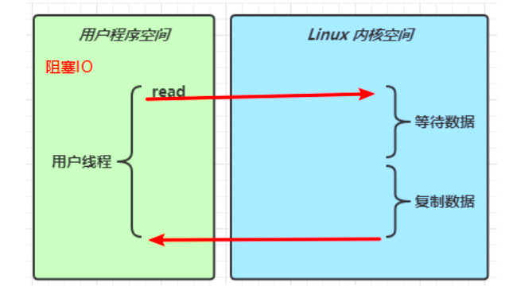
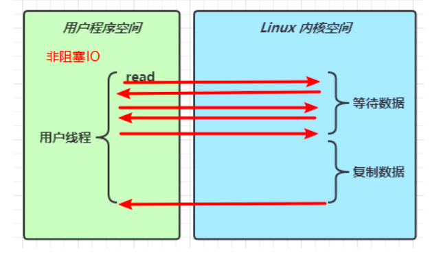
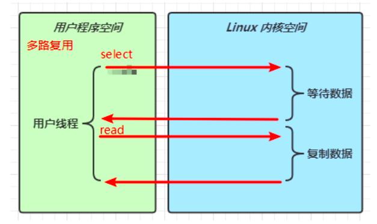
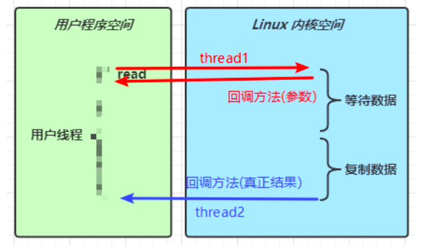
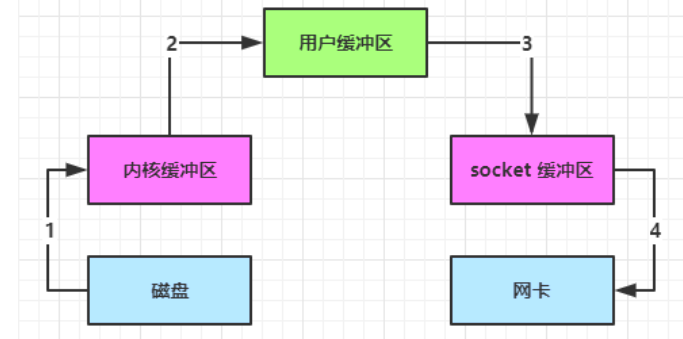
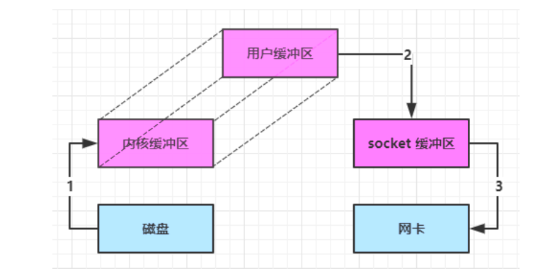
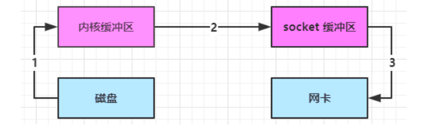

## NIO和BIO

### stream和channel

* stream 不会自动缓冲数据，channel 会利用系统提供的发送缓冲区、接收缓冲区（更为底层）
* stream 仅支持阻塞 API，channel 同时支持阻塞、非阻塞 API，网络 channel 可配合 selector 实现多路复用
* 二者均为全双工，即读写可以同时进行


### IO 模型

同步阻塞、同步非阻塞、同步多路复用、异步阻塞（没有此情况）、异步非阻塞

* 同步：线程自己去获取结果（一个线程）
* 异步：线程自己不去获取结果，而是由其它线程送结果（至少两个线程）


当调用一次 channel.read 或 stream.read 后，会切换至操作系统内核态来完成真正数据读取，而读取又分为两个阶段，分别为：

* 等待数据阶段
* 复制数据阶段


阻塞 IO





非阻塞  IO





多路复用





异步 IO




### 零拷贝

#### 传统 IO 问题

传统的 IO 将一个文件通过 socket 写出内部工作流程是这样的：




1. java 本身并不具备 IO 读写能力，因此 read 方法调用后，要从 java 程序的**用户态**切换至**内核态**，去调用操作系统（Kernel）的读能力，将数据读入**内核缓冲区**。这期间用户线程阻塞，操作系统使用 DMA（Direct Memory Access）来实现文件读，其间也不会使用 cpu
2. 从**内核态**切换回**用户态**，将数据从**内核缓冲区**读入**用户缓冲区**（即 byte[] buf），这期间 cpu 会参与拷贝，无法利用 DMA
3. 调用 write 方法，这时将数据从**用户缓冲区**（byte[] buf）写入 **socket 缓冲区**，cpu 会参与拷贝
4. 接下来要向网卡写数据，这项能力 java 又不具备，因此又得从**用户态**切换至**内核态**，调用操作系统的写能力，使用 DMA 将 **socket 缓冲区**的数据写入网卡，不会使用 cpu


可以看到中间环节较多，java 的 IO 实际不是物理设备级别的读写，而是缓存的复制，底层的真正读写是操作系统来完成的

* 用户态与内核态的切换发生了 3 次，这个操作比较重量级
* 数据拷贝了共 4 次


#### NIO 优化

通过 DirectByteBuf 

* ByteBuffer.allocate(10)  HeapByteBuffer 使用的还是 java 内存
* ByteBuffer.allocateDirect(10)  DirectByteBuffer 使用的是操作系统内存


java 可以使用 DirectByteBuf 将堆外内存映射到 jvm 内存中来直接访问使用

* 这块内存不受 jvm 垃圾回收的影响，因此内存地址固定，有助于 IO 读写
* java 中的 DirectByteBuf 对象仅维护了此内存的虚引用，内存回收分成两步
  * DirectByteBuf 对象被垃圾回收，将虚引用加入引用队列
  * 通过专门线程访问引用队列，根据虚引用释放堆外内存
* 减少了一次数据拷贝，用户态与内核态的切换次数没有减少





进一步优化（底层采用了 linux 2.1 后提供的 sendFile 方法），java 中对应着两个 channel 调用 transferTo/transferFrom 方法拷贝数据


1. java 调用 transferTo 方法后，要从 java 程序的**用户态**切换至**内核态**，使用 DMA将数据读入**内核缓冲区**，不会使用 cpu
2. 数据从**内核缓冲区**传输到 **socket 缓冲区**，cpu 会参与拷贝
3. 最后使用 DMA 将 **socket 缓冲区**的数据写入网卡，不会使用 cpu





进一步优化（linux 2.4）

1. java 调用 transferTo 方法后，要从 java 程序的**用户态**切换至**内核态**，使用 DMA将数据读入**内核缓冲区**，不会使用 cpu
2. 只会将一些 offset 和 length 信息拷入 **socket 缓冲区**，几乎无消耗
3. 使用 DMA 将 **内核缓冲区**的数据写入网卡，不会使用 cpu


整个过程仅只发生了一次用户态与内核态的切换，数据拷贝了 2 次。所谓的【零拷贝】，并不是真正无拷贝，而是在不会拷贝重复数据到 jvm 内存中，零拷贝的优点有：

* 更少的用户态与内核态的切换
* 不利用 cpu 计算，减少 cpu 缓存伪共享
* 零拷贝适合小文件传输


# AIO

AIO 用来解决数据复制阶段的阻塞问题

* 同步意味着，在进行读写操作时，线程需要等待结果，还是相当于闲置
* 异步意味着，在进行读写操作时，线程不必等待结果，而是将来由操作系统来通过回调方式由另外的线程来获得结果


异步模型需要底层操作系统（Kernel）提供支持

* Windows 系统通过 IOCP 实现了真正的异步 IO
* Linux 系统异步 IO 在 2.6 版本引入，但其底层实现还是用多路复用模拟了异步 IO，性能没有优势


## 文件 AIO

默认文件 AIO 使用的线程都是守护线程

```java
package mao.t1;

import lombok.SneakyThrows;
import lombok.extern.slf4j.Slf4j;
import mao.utils.ByteBufferUtil;

import java.nio.ByteBuffer;
import java.nio.channels.AsynchronousFileChannel;
import java.nio.channels.CompletionHandler;
import java.nio.file.Paths;
import java.nio.file.StandardOpenOption;

/**
 * Project name(项目名称)：Netty_AIO
 * Package(包名): mao.t1
 * Class(类名): FileAIO
 * Author(作者）: mao
 * Author QQ：1296193245
 * GitHub：https://github.com/maomao124/
 * Date(创建日期)： 2023/3/16
 * Time(创建时间)： 21:24
 * Version(版本): 1.0
 * Description(描述)： 文件AIO
 */

@Slf4j
public class FileAIO
{
    @SneakyThrows
    public static void main(String[] args)
    {
        try
        {
            log.debug("开始读取...");
            AsynchronousFileChannel asynchronousFileChannel =
                    AsynchronousFileChannel.open(Paths.get("test.txt"), StandardOpenOption.READ);
            ByteBuffer buffer = ByteBuffer.allocate(16);
            asynchronousFileChannel.read(buffer, 0, null, new CompletionHandler<Integer, ByteBuffer>()
            {
                @Override
                public void completed(Integer result, ByteBuffer attachment)
                {
                    log.debug("读取完成：" + result);
                    buffer.flip();
                    ByteBufferUtil.debugAll(buffer);
                }

                @Override
                public void failed(Throwable exc, ByteBuffer attachment)
                {
                    log.warn("读取失败：", exc);
                }
            });
        }
        catch (Exception e)
        {
            e.printStackTrace();
        }

        Thread.sleep(1000);
    }
}
```


运行结果：

```sh
2023-03-16  21:36:19.104  [main] DEBUG mao.t1.FileAIO:  开始读取...
2023-03-16  21:36:19.114  [Thread-33] DEBUG mao.t1.FileAIO:  读取完成：8
2023-03-16  21:36:19.116  [Thread-33] DEBUG io.netty.util.internal.logging.InternalLoggerFactory:  Using SLF4J as the default logging framework
+--------+-------------------- all ------------------------+----------------+
position: [0], limit: [8]
         +-------------------------------------------------+
         |  0  1  2  3  4  5  6  7  8  9  a  b  c  d  e  f |
+--------+-------------------------------------------------+----------------+
|00000000| 31 32 33 34 35 36 0d 0a 00 00 00 00 00 00 00 00 |123456..........|
+--------+-------------------------------------------------+----------------+
```


## 网络 AIO

ReadHandler

```java
package mao.t2;

import lombok.extern.slf4j.Slf4j;

import java.io.IOException;
import java.nio.ByteBuffer;
import java.nio.CharBuffer;
import java.nio.channels.AsynchronousSocketChannel;
import java.nio.channels.CompletionHandler;
import java.nio.charset.Charset;

/**
 * Project name(项目名称)：Netty_AIO
 * Package(包名): mao.t2
 * Class(类名): ReadHandler
 * Author(作者）: mao
 * Author QQ：1296193245
 * GitHub：https://github.com/maomao124/
 * Date(创建日期)： 2023/3/16
 * Time(创建时间)： 21:40
 * Version(版本): 1.0
 * Description(描述)： 读事件处理器
 */

@Slf4j
public class ReadHandler implements CompletionHandler<Integer, ByteBuffer>
{

    /**
     * 异步套接字通道
     */
    private final AsynchronousSocketChannel asynchronousSocketChannel;

    /**
     * 读事件处理器构造方法
     *
     * @param asynchronousSocketChannel 异步套接字通道
     */
    public ReadHandler(AsynchronousSocketChannel asynchronousSocketChannel)
    {
        this.asynchronousSocketChannel = asynchronousSocketChannel;
    }

    @Override
    public void completed(Integer result, ByteBuffer attachment)
    {
        try
        {
            if (result == -1)
            {
                //已读完
                log.debug("读事件处理完成，关闭通道：" + asynchronousSocketChannel);
                asynchronousSocketChannel.close();
            }
            log.debug("读事件：" + asynchronousSocketChannel);
            attachment.flip();
            CharBuffer charBuffer = Charset.defaultCharset().decode(attachment);
            log.debug(charBuffer.toString());
            attachment.clear();
            //处理完第一个 read 时，需要再次调用 read 方法来处理下一个 read 事件
            asynchronousSocketChannel.read(attachment, attachment, this);
        }
        catch (Exception e)
        {
            log.warn("读取时出现异常：", e);
        }
    }

    @Override
    public void failed(Throwable exc, ByteBuffer attachment)
    {
        log.error("读取失败：", exc);
        try
        {
            asynchronousSocketChannel.close();
        }
        catch (IOException ignored)
        {
        }
    }
}
```


WriteHandler

```java
package mao.t2;

import lombok.extern.slf4j.Slf4j;

import java.nio.ByteBuffer;
import java.nio.CharBuffer;
import java.nio.channels.AsynchronousSocketChannel;
import java.nio.channels.CompletionHandler;
import java.nio.charset.Charset;

/**
 * Project name(项目名称)：Netty_AIO
 * Package(包名): mao.t2
 * Class(类名): WriteHandler
 * Author(作者）: mao
 * Author QQ：1296193245
 * GitHub：https://github.com/maomao124/
 * Date(创建日期)： 2023/3/16
 * Time(创建时间)： 21:40
 * Version(版本): 1.0
 * Description(描述)： 写事件处理器
 */

@Slf4j
public class WriteHandler implements CompletionHandler<Integer, ByteBuffer>
{

    /**
     * 异步套接字通道
     */
    private final AsynchronousSocketChannel asynchronousSocketChannel;

    /**
     * 写事件处理器构造方法
     *
     * @param asynchronousSocketChannel 异步套接字通道
     */
    public WriteHandler(AsynchronousSocketChannel asynchronousSocketChannel)
    {
        this.asynchronousSocketChannel = asynchronousSocketChannel;
    }


    @Override
    public void completed(Integer result, ByteBuffer attachment)
    {
        log.debug("写事件");
        if (attachment.hasRemaining())
        {
            //如果有剩余内容,继续写
            asynchronousSocketChannel.write(attachment);
        }
    }

    @Override
    public void failed(Throwable exc, ByteBuffer attachment)
    {
        log.error("写错误：", exc);
    }
}
```


AcceptHandler

```java
package mao.t2;

import lombok.extern.slf4j.Slf4j;

import java.nio.ByteBuffer;
import java.nio.channels.AsynchronousServerSocketChannel;
import java.nio.channels.AsynchronousSocketChannel;
import java.nio.channels.CompletionHandler;
import java.nio.charset.Charset;

/**
 * Project name(项目名称)：Netty_AIO
 * Package(包名): mao.t2
 * Class(类名): AcceptHandler
 * Author(作者）: mao
 * Author QQ：1296193245
 * GitHub：https://github.com/maomao124/
 * Date(创建日期)： 2023/3/16
 * Time(创建时间)： 21:40
 * Version(版本): 1.0
 * Description(描述)： 接收事件处理器
 */

@Slf4j
public class AcceptHandler implements CompletionHandler<AsynchronousSocketChannel, Object>
{
    /**
     * 异步服务器套接字通道
     */
    private final AsynchronousServerSocketChannel asynchronousServerSocketChannel;

    /**
     * 接收事件处理器构造方法
     *
     * @param asynchronousServerSocketChannel 异步服务器套接字通道
     */
    public AcceptHandler(AsynchronousServerSocketChannel asynchronousServerSocketChannel)
    {
        this.asynchronousServerSocketChannel = asynchronousServerSocketChannel;
    }


    @Override
    public void completed(AsynchronousSocketChannel result, Object attachment)
    {
        try
        {
            log.debug("接收事件：" + asynchronousServerSocketChannel.toString());
            ByteBuffer buffer = ByteBuffer.allocate(16);
            //读事件
            result.read(buffer, buffer, new ReadHandler(result));
            //写事件
            result.write(Charset.defaultCharset().encode("hello"),
                    ByteBuffer.allocate(16), new WriteHandler(result));
            //处理完第一个 accept事件时，需要再次调用 accept 方法来处理下一个 accept 事件
            asynchronousServerSocketChannel.accept(null, this);
        }
        catch (Exception e)
        {
            log.warn("处理接收事件时出现异常：" + e);
        }
    }

    @Override
    public void failed(Throwable exc, Object attachment)
    {
        log.error("接收异常：" + exc);
    }
}
```


AioServer

```java
package mao.t2;

import lombok.SneakyThrows;
import lombok.extern.slf4j.Slf4j;

import java.net.InetSocketAddress;
import java.nio.channels.AsynchronousServerSocketChannel;
import java.util.concurrent.locks.LockSupport;

/**
 * Project name(项目名称)：Netty_AIO
 * Package(包名): mao.t2
 * Class(类名): AioServer
 * Author(作者）: mao
 * Author QQ：1296193245
 * GitHub：https://github.com/maomao124/
 * Date(创建日期)： 2023/3/16
 * Time(创建时间)： 21:39
 * Version(版本): 1.0
 * Description(描述)： 无
 */

@Slf4j
public class AioServer
{
    @SneakyThrows
    public static void main(String[] args)
    {
        AsynchronousServerSocketChannel asynchronousServerSocketChannel = AsynchronousServerSocketChannel.open();
        asynchronousServerSocketChannel.bind(new InetSocketAddress(8080));
        asynchronousServerSocketChannel.accept(null, new AcceptHandler(asynchronousServerSocketChannel));
        log.debug("注册服务");

        //因为是异步，所以要阻塞
        LockSupport.park();
    }
}
```


Client

```java
package mao.t2;

import lombok.SneakyThrows;
import lombok.extern.slf4j.Slf4j;
import mao.utils.ByteBufferUtil;

import java.net.InetSocketAddress;
import java.nio.ByteBuffer;
import java.nio.channels.SelectionKey;
import java.nio.channels.Selector;
import java.nio.channels.SocketChannel;
import java.nio.charset.Charset;
import java.util.Iterator;

/**
 * Project name(项目名称)：Netty_AIO
 * Package(包名): mao.t2
 * Class(类名): Client
 * Author(作者）: mao
 * Author QQ：1296193245
 * GitHub：https://github.com/maomao124/
 * Date(创建日期)： 2023/3/16
 * Time(创建时间)： 22:05
 * Version(版本): 1.0
 * Description(描述)： 客户端
 */

@Slf4j
public class Client
{
    @SneakyThrows
    public static void main(String[] args)
    {
        Selector selector = Selector.open();
        SocketChannel socketChannel = SocketChannel.open();
        socketChannel.configureBlocking(false);
        socketChannel.register(selector, SelectionKey.OP_CONNECT | SelectionKey.OP_READ);
        socketChannel.connect(new InetSocketAddress("localhost", 8080));
        new Thread(new Runnable()
        {
            @SneakyThrows
            @Override
            public void run()
            {
                while (true)
                {
                    log.debug("客户端写数据");
                    socketChannel.write(Charset.defaultCharset().encode("hello server!"));
                    Thread.sleep(2000);
                }
            }
        }).start();

        int count = 0;
        while (true)
        {
            selector.select();
            Iterator<SelectionKey> iterator = selector.selectedKeys().iterator();
            while (iterator.hasNext())
            {
                SelectionKey selectionKey = iterator.next();
                if (selectionKey.isConnectable())
                {
                    log.debug(String.valueOf(socketChannel.finishConnect()));
                }
                //可读
                else if (selectionKey.isReadable())
                {
                    log.debug("客户端读事件");
                    ByteBuffer buffer = ByteBuffer.allocate(16);
                    count += socketChannel.read(buffer);
                    ByteBufferUtil.debugAll(buffer);
                    buffer.clear();
                }
                iterator.remove();
            }
        }
    }
}
```


服务端运行结果：

```sh
2023-03-16  22:17:33.929  [main] DEBUG mao.t2.AioServer:  注册服务
2023-03-16  22:17:38.058  [Thread-34] DEBUG mao.t2.AcceptHandler:  接收事件：sun.nio.ch.WindowsAsynchronousServerSocketChannelImpl[/0:0:0:0:0:0:0:0:8080]
2023-03-16  22:17:38.060  [Thread-33] DEBUG mao.t2.WriteHandler:  写事件
2023-03-16  22:17:38.061  [Thread-32] DEBUG mao.t2.ReadHandler:  读事件：sun.nio.ch.WindowsAsynchronousSocketChannelImpl[connected local=/127.0.0.1:8080 remote=/127.0.0.1:49998]
2023-03-16  22:17:38.061  [Thread-32] DEBUG mao.t2.ReadHandler:  hello server!
2023-03-16  22:17:40.074  [Thread-32] DEBUG mao.t2.ReadHandler:  读事件：sun.nio.ch.WindowsAsynchronousSocketChannelImpl[connected local=/127.0.0.1:8080 remote=/127.0.0.1:49998]
2023-03-16  22:17:40.074  [Thread-32] DEBUG mao.t2.ReadHandler:  hello server!
2023-03-16  22:17:42.089  [Thread-32] DEBUG mao.t2.ReadHandler:  读事件：sun.nio.ch.WindowsAsynchronousSocketChannelImpl[connected local=/127.0.0.1:8080 remote=/127.0.0.1:49998]
2023-03-16  22:17:42.089  [Thread-32] DEBUG mao.t2.ReadHandler:  hello server!
2023-03-16  22:17:44.093  [Thread-32] DEBUG mao.t2.ReadHandler:  读事件：sun.nio.ch.WindowsAsynchronousSocketChannelImpl[connected local=/127.0.0.1:8080 remote=/127.0.0.1:49998]
2023-03-16  22:17:44.093  [Thread-32] DEBUG mao.t2.ReadHandler:  hello server!
2023-03-16  22:17:46.106  [Thread-32] DEBUG mao.t2.ReadHandler:  读事件：sun.nio.ch.WindowsAsynchronousSocketChannelImpl[connected local=/127.0.0.1:8080 remote=/127.0.0.1:49998]
2023-03-16  22:17:46.106  [Thread-32] DEBUG mao.t2.ReadHandler:  hello server!
```


客户端运行结果：

```sh
2023-03-16  22:17:38.059  [Thread-1] DEBUG mao.t2.Client:  客户端写数据
2023-03-16  22:17:38.059  [main] DEBUG mao.t2.Client:  true
2023-03-16  22:17:38.061  [main] DEBUG mao.t2.Client:  客户端读事件
2023-03-16  22:17:38.064  [main] DEBUG io.netty.util.internal.logging.InternalLoggerFactory:  Using SLF4J as the default logging framework
+--------+-------------------- all ------------------------+----------------+
position: [16], limit: [16]
         +-------------------------------------------------+
         |  0  1  2  3  4  5  6  7  8  9  a  b  c  d  e  f |
+--------+-------------------------------------------------+----------------+
|00000000| 68 65 6c 6c 6f 00 00 00 00 00 00 00 00 00 00 00 |hello...........|
+--------+-------------------------------------------------+----------------+
2023-03-16  22:17:38.069  [main] DEBUG mao.t2.Client:  客户端读事件
+--------+-------------------- all ------------------------+----------------+
position: [5], limit: [16]
         +-------------------------------------------------+
         |  0  1  2  3  4  5  6  7  8  9  a  b  c  d  e  f |
+--------+-------------------------------------------------+----------------+
|00000000| 00 00 00 00 00 00 00 00 00 00 00 00 00 00 00 00 |................|
+--------+-------------------------------------------------+----------------+
2023-03-16  22:17:40.074  [Thread-1] DEBUG mao.t2.Client:  客户端写数据
2023-03-16  22:17:42.089  [Thread-1] DEBUG mao.t2.Client:  客户端写数据
2023-03-16  22:17:44.093  [Thread-1] DEBUG mao.t2.Client:  客户端写数据
2023-03-16  22:17:46.106  [Thread-1] DEBUG mao.t2.Client:  客户端写数据
```


